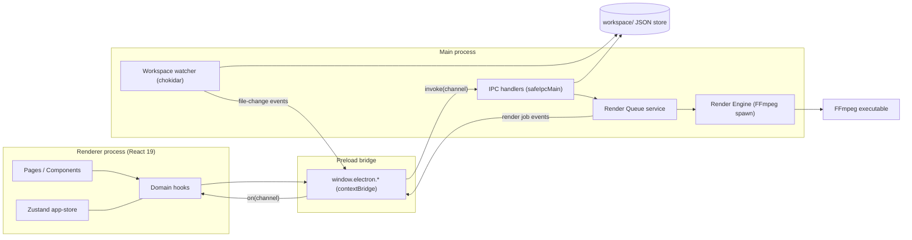

# Architecture Documentation
<!-- markdownlint-disable -->


This document serves as the canonical architectural map of the repository. It outlines the design patterns, technical stack, directory structure, and module constraints to assist developers and AI agents in navigating and maintaining the codebase safely.

## 1. Project Overview

Social Content Studio is a local-first Electron desktop application for managing social-media content production. It lets a solo creator manage multiple brand accounts, author HTML-based content templates, organize local media assets, compose content items against those templates, and render final vertical videos through an FFmpeg-backed render queue.

Core business value:

- **Content lifecycle management** — ideas progress through a strict status machine (`idea → draft → ready → rendering → ready-to-post → posted`, plus `failed` recovery paths).
- **Multi-account workspaces** — accounts live as folders under `workspace/accounts`, each with branding and workflow configuration.
- **HTML template composition** — templates pair `index.html` + `style.css` with a `template.json` descriptor; content fills template variables.
- **Manual publishing boundary** — the app produces ready-to-post outputs; actual publishing to platforms is done manually by the user (no platform API integrations by design).

Intended audience: a technical solo operator running several social-media brands from one machine (Windows).

## 2. High-Level Architecture & Tech Stack

- **Primary Language:** TypeScript (strict, ESM) across all processes
- **Frameworks/Libraries:**
  - Electron 35 (desktop shell, 3-process model)
  - React 19 + React Router 7 (renderer UI)
  - Zustand 5 (client state), Tailwind CSS 4 + Lucide icons (styling)
  - Monaco Editor (@monaco-editor/react) for HTML template editing
  - chokidar 4 (workspace filesystem watching)
- **Architectural Pattern:** Process-separated Electron architecture with a **shared-contract package** (`packages/shared`) consumed directly by both main and renderer. Persistence is **file-backed JSON** inside `workspace/` (no database). Communication follows a strict **IPC boundary**: renderer never touches Node/Electron APIs directly.
- **Build/Tooling:** electron-vite 3 on Vite 6; Bun as script runner/runtime (`bun run *`); TypeScript project splitting (`tsconfig.node.json` for main/preload, `tsconfig.web.json` for renderer/shared).

## 3. Data Flow & Layer Dependencies

Request lifecycle (example: creating a content item):

```text
React page/component
  → domain hook (src/renderer/src/hooks/useContents.ts)
    → window.electron.workspace.createContent()   [preload contextBridge]
      → ipcRenderer.invoke('workspace:create-content')
        → safeIpcMain handler (src/main/ipc/filesystem.ts)
          → fs writes workspace/contents/<id>/content.json
          ← { success: true, data: Content }
      ← same envelope back up the chain
```

Asynchronous event flows travel the reverse direction: the chokidar watcher and the render queue emit channels that the preload `on()` helper forwards into React hooks.



Layer dependency rules:

- `packages/shared` depends on nothing; both processes depend on it.
- `renderer → preload → main` is the only cross-process path.
- Main-process handlers resolve workspace paths from `process.cwd()/workspace` (known inconsistency with the `workspacePath` setting — see Section 11).

## 4. Dependencies & External Services

- **FFmpeg:** external executable required at render time; location configurable via `workspace/config/settings.json` (`ffmpegPath`). Spawned only by the main-process render engine.
- **chokidar:** watches the workspace tree and broadcasts `FileChangeEvent`s to the renderer.
- **No cloud services / databases:** everything persists to local disk. Network access is limited to resource downloading handled by `workspace:*`/resource IPC (internet-video workflow inputs).

Key npm dependencies (runtime): `react`, `react-dom`, `react-router-dom`, `zustand`, `@monaco-editor/react`, `lucide-react`, `chokidar`, `clsx`, `tailwind-merge`, `class-variance-authority`.

## 5. Directory Tree Map

```text
[Project Root]
├── .agents/                  # AI agent configurations and SDLC standards
├── docs/                     # Project documentation (this file, ADRs, discovery drafts)
├── packages/
│   └── shared/
│       └── src/              # Canonical domain contracts (types, status flow, errors)
│           ├── index.ts      # Content/Account/Template/Recipe/RenderJob/AppSettings types
│           ├── errors.ts     # AppError model + ErrorCode union
│           ├── resource.ts   # Resource-related contracts
│           └── template.ts   # Template-related contracts
├── scripts/
│   └── init-workspace.ts     # Seeds the default workspace folder layout (bun)
├── src/
│   ├── main/                 # Electron main process
│   │   ├── index.ts          # App bootstrap, window creation, IPC registration
│   │   ├── errors.ts         # Logging + error handler initialization
│   │   ├── ipc/              # Channel registrations grouped by domain
│   │   │   ├── safe-handler.ts  # safeIpcMain wrapper (error envelope enforcement)
│   │   │   ├── filesystem.ts    # fs:* + workspace:* CRUD handlers
│   │   │   ├── render.ts        # render:start/cancel/jobs/thumbnail/concurrency
│   │   │   ├── batch.ts         # CSV-driven bulk content creation/enqueue
│   │   │   ├── backup.ts        # workspace export/import
│   │   │   └── resource.ts      # asset/resource ingestion
│   │   ├── services/
│   │   │   ├── render-queue.ts  # Job queue honoring maxConcurrentRender
│   │   │   └── render-engine.ts # FFmpeg command construction/spawn per preset
│   │   └── watchers/
│   │       └── index.ts         # chokidar wiring → FileChangeEvent broadcast
│   └── preload/
│       └── index.ts          # contextBridge API surface (window.electron.*)
└── workspace/                # File-backed data store (gitignored data, real user data)
    ├── accounts/<account>/account.json
    ├── templates/<template>/{template.json,index.html,style.css}
    ├── contents/<id>/content.json      # created lazily on first content
    ├── assets/{images,audio,video,fonts}/
    └── config/settings.json            # AppSettings persistence
```

## 6. Directory Purposes & Responsibilities

| Directory/File | Primary Purpose | Contains | Rules / Constraints |
|---|---|---|---|
| `packages/shared/src/` | Canonical domain contract | Types, `CONTENT_STATUS_FLOW`, `DEFAULT_RENDER_PRESETS`, error codes | No dependencies; consumers and persisted JSON must stay in sync when changed |
| `src/main/` | Electron main process | Bootstrap, IPC, services, watchers | Only layer allowed to touch Node APIs and spawn FFmpeg |
| `src/main/ipc/safe-handler.ts` | Error-envelope enforcement | `safeIpcMain(channel, handler, errorCode)` | All new channels must register through it; responses use `{ success, data }` / `{ success: false, error }` |
| `src/main/services/` | Render pipeline core | Queue (concurrency-limited) + engine | Renders enqueue via IPC only; concurrency from `maxConcurrentRender` |
| `src/main/watchers/` | Workspace change feed | chokidar setup | Emits typed `FileChangeEvent`s to renderer |
| `src/preload/index.ts` | Security bridge | Namespaced `electronAPI` exposed as `window.electron` | Must stay synchronized with `src/main/ipc/*` and `src/renderer/src/lib/electron.d.ts` |
| `src/renderer/src/pages/` | Route screens | 12 pages (dashboard … logs) | Routes must stay synchronized with sidebar navigation |
| `src/renderer/src/stores/` | Global client state | Single Zustand `app-store.ts` | Server-state lives in hooks, not the store |
| `src/renderer/src/hooks/` | Domain data access | useAccounts/useContents/useTemplates/useRenderQueue/etc. | Async loads must surface loading/empty/error states |
| `src/renderer/src/lib/electron.d.ts` | Typed bridge surface | `Window.electron` declaration | Update together with preload when API changes |
| `scripts/init-workspace.ts` | Workspace scaffolding | Folder bootstrap script | Run via `bun run workspace:init` |
| `workspace/` | Persistent data store | Accounts, templates, contents, assets, settings | JSON-file backed; no database allowed (MVP rule) |

## 7. Key Configuration Files

* `package.json` — scripts (`dev`, `build`, `typecheck:node|web`, `workspace:init`); documents the absence of a test runner today.
* `electron.vite.config.ts` — three-config build topology (main / preload / renderer), path aliases, Tailwind v4 vite plugin.
* `tsconfig.json` + `tsconfig.node.json` + `tsconfig.web.json` — splits typechecking between Node-side (main/preload/shared) and web-side (renderer/shared); both must pass before merges.
* `workspace/config/settings.json` — persisted `AppSettings` (`defaultPreset`, `maxConcurrentRender`, `workspacePath`, `ffmpegPath`). Note: `workspacePath` is currently informational only; runtime resolution hardcodes `process.cwd()/workspace`.
* `.gitignore` — excludes `node_modules`, build output, and (intentionally or not) local workspace data specifics.

## 8. Entry Points

* **App Initialization (main):** `src/main/index.ts` — `app.whenReady()` → `createWindow()` → registers all IPC modules (`initFileSystemIpc`, `registerSafeIpc`, `initRenderIpc`, `initResourceIpc`, `initBackupIpc`, `initBatchIpc`, `initWatcherService`).
* **App Initialization (preload):** `src/preload/index.ts` — exposes the single `window.electron` bridge.
* **Routing/Navigation:** `src/renderer/src/main.tsx` mounts React; `src/renderer/src/App.tsx` defines the route table mirrored by `components/layout/Sidebar.tsx`.

## 9. Environment & Deployment

- **CI/CD:** none configured.
- **Deployment:** local desktop execution only (`bun run dev` for development with HMR via `ELECTRON_RENDERER_URL`; `bun run build` produces `out/`). No packaging/distribution pipeline (e.g., electron-builder) is set up yet.
- **Environment variables:** `ELECTRON_RENDERER_URL` (dev-only renderer URL injection by electron-vite). No secrets are used by design.

## 10. Testing Strategy

- **Framework:** none installed. There is currently **no unit/integration/E2E test harness** in this repository — a known gap versus the project's Two-Layer Testing Mandate.
- **Location:** n/a (no `tests/` directories or `*.spec.ts` files present).
- **Run Command:** n/a. Available verification commands are static checks only:
  - `bun run typecheck:node` (main + preload + shared)
  - `bun run typecheck:web` (renderer + shared)
  - `bun run build` (required when touching entrypoints, preload, IPC, or rendering)

Any agent introducing tests must first add the framework deliberately (e.g., vitest) rather than assuming its presence.

## 11. AI Agent Boundaries

Constraints distilled from root `AGENTS.md` plus observed code reality:

- Treat `packages/shared/src/` as the source of truth. Never invent fields (e.g., no `platform` on `Content`; no landscape YouTube preset; no `scheduled` status) without migrating shared types, renderer, main handlers, and persisted JSON together.
- Respect `CONTENT_STATUS_FLOW`; never assign statuses outside allowed transitions.
- Keep IPC channel names and response shapes synchronized across `src/main/ipc/`, `src/preload/index.ts`, and `src/renderer/src/lib/electron.d.ts`.
- Renderer code must not import Node or Electron APIs; everything crosses through `window.electron`.
- Validate and constrain filesystem paths in the main process. **Current gap:** generic `fs:*` handlers accept arbitrary absolute paths from the renderer (including recursive delete). Do not widen this surface; prefer confining new handlers to the workspace root.
- Rendering must go through the render IPC + queue service (`maxConcurrentRender` honored); never spawn FFmpeg from React.
- Do not claim Playwright/Chromium HTML-to-video capability — it is not a dependency.
- Prefer the checked-in workspace layout (`accounts/`, `templates/`, `contents/`, …) over layouts described in older product prose.
- Before completing any change: run `bun run typecheck` (and `bun run build` when entrypoints/IPC/rendering changed); add focused tests once a harness exists.
