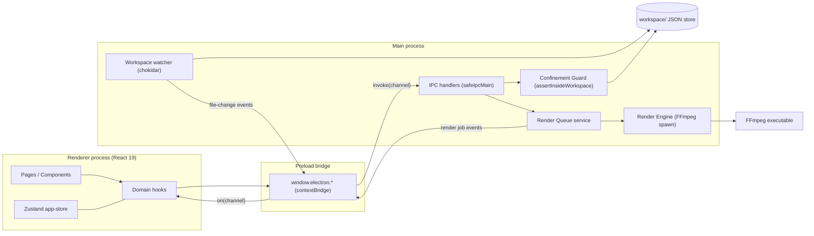

# Architecture Documentation
<!-- markdownlint-disable -->


This document serves as the canonical architectural map of the repository. It outlines the design patterns, technical stack, directory structure, and module constraints to assist developers and AI agents in navigating and maintaining the codebase safely.

> **Last major update:** Foundation Stabilization (2026-08-24) — added a shared-contract `LoadedEntry<T>` data model, a Confinement Guard for every path-taking IPC channel, durable content IDs, atomic JSON writes, a content lifecycle transition guard, a startup sweep for interrupted renders, and a `bun test` harness. See `docs/adr/0001-backup-confinement-whitelist.md` and the spec `spec/spec-architecture-foundation-stabilization.md`.

## 1. Project Overview

Social Content Studio is a local-first Electron desktop application for managing social-media content production. It lets a solo creator manage multiple brand accounts, author HTML-based content templates, organize local media assets, compose content items against those templates, and render final vertical videos through an FFmpeg-backed render queue.

Core business value:

- **Content lifecycle management** — ideas progress through a strict status machine (`idea → draft → ready → rendering → ready-to-post → posted`, plus `failed` recovery paths). Status mutations MUST pass through `assertLegalTransition` (CON-002 rule).
- **Multi-account workspaces** — accounts live as folders under `workspace/accounts`, each with branding and workflow configuration.
- **HTML template composition** — templates pair `index.html` + `style.css` with a `template.json` descriptor; content fills template variables.
- **Manual publishing boundary** — the app produces ready-to-post outputs; actual publishing to platforms is done manually by the user (no platform API integrations by design).

Intended audience: a technical solo operator running several social-media brands from one machine (Windows).

## 2. High-Level Architecture & Tech Stack

- **Primary Language:** TypeScript (strict, ESM) across all processes
- **Frameworks/Libraries:**
  - Electron 35 (desktop shell, 3-process model)
  - React 19 + React Router 7 (renderer UI)
  - Zustand 5 (client state), Tailwind CSS 4 + Lucide icons (styling)
  - Monaco Editor (@monaco-editor/react) for HTML template editing
  - chokidar 4 (workspace filesystem watching)
  - adm-zip 0.6 (pure-Node backup archive — no shell spawned)
- **Architectural Pattern:** Process-separated Electron architecture with a **shared-contract package** (`packages/shared`) consumed directly by both main and renderer. Persistence is **file-backed JSON** inside `workspace/` (no database). Communication follows a strict **IPC boundary**: renderer never touches Node/Electron APIs directly.
- **Build/Tooling:** electron-vite 3 on Vite 6; Bun as script runner/runtime (`bun run *`); TypeScript project splitting (`tsconfig.node.json` for main/preload/shared, `tsconfig.web.json` for renderer/shared).

## 3. Data Flow & Layer Dependencies

Request lifecycle (example: creating a content item):

```text
React page/component
  → domain hook (src/renderer/src/hooks/useContents.ts)
    → window.electron.workspace.createContent()   [preload contextBridge]
      → ipcRenderer.invoke('workspace:create-content')
        → safeIpcMain handler (src/main/ipc/filesystem.ts)
          → generateUniqueContentId() → fs writes workspace/contents/<id>/content.json (atomicWriteJson)
          ← { success: true, data: Content }
      ← same envelope back up the chain
```

Reads shape every document as a `LoadedEntry<T>` so corrupt JSON never throws — the renderer receives `{ kind: 'valid', data }` or `{ kind: 'invalid', issues }` and surfaces a quarantine card instead of crashing.

Asynchronous event flows travel the reverse direction: the chokidar watcher and the render queue emit channels that the preload `on()` helper forwards into React hooks.



Layer dependency rules:

- `packages/shared` depends on nothing; both processes depend on it.
- `renderer → preload → main` is the only cross-process path.
- **Workspace root is resolved centrally** via `getWorkspaceRoot()` (`src/main/services/workspace-root.ts`), which reads the persisted `workspacePath` from `workspace/config/settings.json` and throws (no silent fallback) when a configured path is missing/invalid. The legacy `process.cwd()/workspace` is only the fresh-install default.

## 4. Dependencies & External Services

- **FFmpeg:** external executable required at render time; location configurable via `workspace/config/settings.json` (`ffmpegPath`). Spawned only by the main-process render engine. Validity is checked with `ffmpeg -version` (not by assuming any non-directory file is valid).
- **chokidar:** watches the workspace tree and broadcasts `FileChangeEvent`s to the renderer.
- **adm-zip:** pure-Node ZIP read/write for workspace backup export/import. **No shell is spawned** — backup paths are confined via `assertInsideWorkspace` before archiving (closure of the prior PowerShell `execSync` command-injection vector).
- **No cloud services / databases:** everything persists to local disk. Network access is limited to resource downloading handled by `workspace:*`/resource IPC (internet-video workflow inputs).

Key runtime npm dependencies: `react`, `react-dom`, `react-router-dom`, `zustand`, `@monaco-editor/react`, `lucide-react`, `chokidar`, `adm-zip`, `clsx`, `tailwind-merge`, `class-variance-authority`.

## 5. Directory Tree Map

```text
[Project Root]
├── .agents/                  # AI agent configurations and SDLC standards/skills
├── docs/                     # Project documentation (ARCHITECTURE, ADRs, discovery/PRD/spec/audit drafts)
├── packages/
│   └── shared/
│       └── src/              # Canonical domain contracts (types, status flow, errors, validators)
│           ├── index.ts      # Content/Account/Template/Recipe/RenderJob/AppSettings types + CONTENT_STATUS_FLOW
│           ├── errors.ts     # AppError model + ErrorCode union
│           ├── validators.ts # type-guard validators (validateContent/Template/Account)
│           ├── loaded-entry.ts # LoadedEntry<T> discriminated union (valid | invalid)
│           └── resource.ts / template.ts  # Resource/ Template contracts
├── scripts/
│   └── init-workspace.ts     # Seeds the default workspace folder layout (bun)
├── src/
│   ├── main/                 # Electron main process
│   │   ├── index.ts          # App bootstrap, window creation, IPC registration
│   │   ├── errors.ts         # Logging + error handler initialization
│   │   ├── ipc/              # Channel registrations grouped by domain
│   │   │   ├── safe-handler.ts  # safeIpcMain wrapper (error envelope enforcement)
│   │   │   ├── filesystem.ts    # fs:* + workspace:* CRUD handlers (confined)
│   │   │   ├── render.ts        # render:start/cancel/jobs/thumbnail/concurrency
│   │   │   ├── batch.ts         # CSV-driven bulk content creation/enqueue
│   │   │   ├── backup.ts        # workspace export/import (adm-zip, no shell)
│   │   │   └── resource.ts      # asset/resource ingestion
│   │   ├── services/
│   │   │   ├── path-guard.ts     # assertInsideWorkspace Confinement Guard + symlink realpath re-check
│   │   │   ├── workspace-root.ts # getWorkspaceRoot() centralized resolver
│   │   │   ├── id.ts             # generateUniqueContentId (durable, content-<ts>-<hex>)
│   │   │   ├── persistence.ts    # atomicWriteJson + mergeKnownFields
│   │   │   ├── lifecycle.ts      # assertLegalTransition (CONTENT_STATUS_FLOW)
│   │   │   ├── render-queue.ts   # Job queue honoring maxConcurrentRender
│   │   │   └── render-engine.ts  # FFmpeg command construction/spawn per preset
│   │   └── watchers/
│   │       └── index.ts          # chokidar wiring → FileChangeEvent broadcast
│   └── preload/
│       └── index.ts          # contextBridge API surface (window.electron.*)
├── tests/                    # bun test harness (mirrors src/)
│   ├── validators/           # document validator tests
│   ├── services/             # path-guard, id, persistence, lifecycle tests
│   └── security/             # confinement + no-shell backup tests
└── workspace/                # File-backed data store (gitignored data, real user data)
    ├── accounts/<account>/account.json
    ├── templates/<template>/{template.json,index.html,style.css}
    ├── contents/<id>/content.json      # created lazily on first content
    ├── assets/{images,audio,video,fonts}/
    └── config/settings.json            # AppSettings persistence
```

## 6. Directory Purposes & Responsibilities

| Directory/File | Primary Purpose | Contains | Rules / Constraints |
|---|---|---|---|
| `packages/shared/src/` | Canonical domain contract | Types, `CONTENT_STATUS_FLOW`, `LoadedEntry<T>`, `DEFAULT_RENDER_PRESETS`, error codes, validators | No dependencies; consumers and persisted JSON must stay in sync when changed |
| `src/main/` | Electron main process | Bootstrap, IPC, services, watchers | Only layer allowed to touch Node APIs and spawn FFmpeg |
| `src/main/ipc/safe-handler.ts` | Error-envelope enforcement | `safeIpcMain(channel, handler, errorCode)` | All new channels must register through it; responses use `{ success, data }` / `{ success: false, error }` |
| `src/main/services/path-guard.ts` | Confinement Guard | `assertInsideWorkspace` (lexical + `realpath` symlink re-check) | MUST wrap every path-taking IPC channel; refuses `..`, other-drive, root itself |
| `src/main/services/workspace-root.ts` | Workspace root resolver | `getWorkspaceRoot()` | Single source of truth; throws on invalid configured path (no silent fallback) |
| `src/main/services/id.ts` | Durable content IDs | `generateUniqueContentId(root)` | Format `content-<YYYYMMDDTHHMMSS>-<5hex>`; existence-loop (max 5) |
| `src/main/services/persistence.ts` | Atomic persistence | `atomicWriteJson`, `mergeKnownFields` | All JSON writes via temp + rename; permit-list merge for `update-content` |
| `src/main/services/lifecycle.ts` | Status transition guard | `assertLegalTransition(from, to)` | All status writes MUST pass through it |
| `src/main/ipc/filesystem.ts` | fs:* + workspace:* CRUD | Confined handlers, `LoadedEntry` reads, startup sweep | `workspace:*` handlers validate `id` (SAFE_ID regex) + confine constructed paths; backup channels no longer bypass the guard |
| `src/main/ipc/backup.ts` | Workspace export/import | adm-zip archive (no shell) | Confines output/input paths; atomic settings write |
| `src/main/services/` (render-*) | Render pipeline core | Queue (concurrency-limited) + engine | Renders enqueue via IPC only; concurrency from `maxConcurrentRender` |
| `src/main/watchers/` | Workspace change feed | chokidar setup | Emits typed `FileChangeEvent`s to renderer |
| `src/preload/index.ts` | Security bridge | Namespaced `electronAPI` exposed as `window.electron` | Must stay synchronized with `src/main/ipc/*` and `src/renderer/src/lib/electron.d.ts` |
| `src/renderer/src/pages/` | Route screens | 12 pages (dashboard … logs) | Routes must stay synchronized with sidebar navigation |
| `src/renderer/src/stores/` | Global client state | Single Zustand `app-store.ts` | Server-state lives in hooks, not the store |
| `src/renderer/src/hooks/` | Domain data access | useAccounts/useContents/useTemplates/useRenderQueue/etc. | Async loads must surface loading/empty/error states; reshape `LoadedEntry` to typed array |
| `src/renderer/src/lib/electron.d.ts` | Typed bridge surface | `Window.electron` declaration | Update together with preload when API changes |
| `src/renderer/src/components/QuarantineCard.tsx` | Corrupt-data UX | Read-only broken-entry card | Renders `LoadedEntry.invalid` (issues) without fabricated data |
| `scripts/init-workspace.ts` | Workspace scaffolding | Folder bootstrap script | Run via `bun run workspace:init` |
| `tests/` | Test harness | Mirrors `src/`; `bun test` | Run before merges; mutation-sensitive (see plan §5) |
| `workspace/` | Persistent data store | Accounts, templates, contents, assets, settings | JSON-file backed; no database allowed (MVP rule) |

## 7. Key Configuration Files

* `package.json` — scripts (`dev`, `build`, `typecheck:node|web`, `test`, `workspace:init`). `bun test` is the unit/integration runner; `bun.lock` is committed for reproducible installs.
* `electron.vite.config.ts` — three-config build topology (main / preload / renderer), path aliases, Tailwind v4 vite plugin.
* `tsconfig.json` + `tsconfig.node.json` + `tsconfig.web.json` — splits typechecking between Node-side (main/preload/shared) and web-side (renderer/shared); both must pass before merges.
* `workspace/config/settings.json` — persisted `AppSettings` (`defaultPreset`, `maxConcurrentRender`, `workspacePath`, `ffmpegPath`). `workspacePath` is now authoritative for runtime root resolution (resolved centrally by `getWorkspaceRoot`).
* `.gitignore` — excludes `node_modules`, build output, and local workspace data specifics.

## 8. Entry Points

* **App Initialization (main):** `src/main/index.ts` — `app.whenReady()` → `createWindow()` → registers all IPC modules (`initFileSystemIpc`, `registerSafeIpc`, `initRenderIpc`, `initResourceIpc`, `initBackupIpc`, `initBatchIpc`, `initWatcherService`). The startup sweep (`startupSweep`) runs once at `initFileSystemIpc` to recover interrupted renders.
* **App Initialization (preload):** `src/preload/index.ts` — exposes the single `window.electron` bridge.
* **Routing/Navigation:** `src/renderer/src/main.tsx` mounts React; `src/renderer/src/App.tsx` defines the route table mirrored by `components/layout/Sidebar.tsx`.

## 9. Environment & Deployment

- **CI/CD:** none configured.
- **Deployment:** local desktop execution only (`bun run dev` for development with HMR via `ELECTRON_RENDERER_URL`; `bun run build` produces `out/`). No packaging/distribution pipeline (e.g., electron-builder) is set up yet.
- **Environment variables:** `ELECTRON_RENDERER_URL` (dev-only renderer URL injection by electron-vite). No secrets are used by design.

## 10. Testing Strategy

- **Framework:** Bun's built-in test runner (`bun test`).
- **Location:** `tests/` mirroring `src/` (`validators/`, `services/`, `security/`).
- **Run Command:** `bun test` (full suite, ~31 tests, <2 min). Static checks: `bun run typecheck` and `bun run build`.
- The harness is **mutation-sensitive**: tests assert the real durable-ID shape and refute count-based/unguarded variants, so reintroducing the old bugs fails the suite (verified during the Stabilization review).

## 11. AI Agent Boundaries

Constraints distilled from root `AGENTS.md` plus observed code reality:

- Treat `packages/shared/src/` as the source of truth. Never invent fields (e.g., no `platform` on `Content`; no landscape YouTube preset; no `scheduled` status) without migrating shared types, renderer, main handlers, and persisted JSON together.
- Respect `CONTENT_STATUS_FLOW`; all status writes MUST route through `assertLegalTransition` (enforced in `workspace:update-content` and the startup sweep).
- Keep IPC channel names and response shapes synchronized across `src/main/ipc/`, `src/preload/index.ts`, and `src/renderer/src/lib/electron.d.ts`.
- Renderer code must not import Node or Electron APIs; everything crosses through `window.electron`.
- **Path confinement is mandatory.** Every path-taking IPC channel MUST pass its candidate through `assertInsideWorkspace`; `workspace:*` handlers MUST additionally validate the client-supplied `id` (SAFE_ID regex) and confine the constructed path. The Confinement Guard also re-checks `realpath` to defeat symlink escapes.
- **No shell in main process.** Backup archiving uses adm-zip; never reintroduce `execSync`/`powershell` with caller-controlled paths.
- Rendering must go through the render IPC + queue service (`maxConcurrentRender` honored); never spawn FFmpeg from React.
- Do not claim Playwright/Chromium HTML-to-video capability — it is not a dependency.
- Reads return `LoadedEntry<T>`: handle the `invalid` branch (quarantine card) rather than assuming `data` is present.
- Before completing any change: run `bun run typecheck`, `bun run build`, and `bun test`; all must pass.
